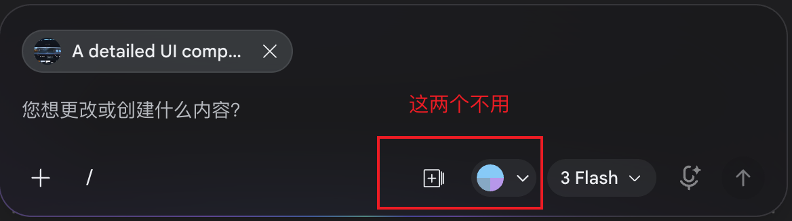

# 警情处置控制台页面语言

## 画布

页面是一张高密度处置工作台，不是大屏展示页，也不是产品说明页。

画布应固定在一个完整浏览器视口内，主体信息沿水平方向展开。视觉气质是冷静、克制、可靠、可扫读。背景不做强装饰，不使用大面积渐变、光斑、抽象纹理或营销式 hero。所有视觉层级都服务于警情、任务、消息、卡片和指令。

页面主要由五块组成：

- 顶部状态栏。
- 中央业务卡片工作区。
- 智能协同侧栏。
- 底部指令坞。
- 警情事件入口。

这些区域应像同一套指挥工具的不同功能面板，而不是几张独立卡片拼在一起。

## 顶部状态栏

顶部状态栏横跨整个页面，保持低高度、高信息密度。

左侧放产品身份：

- 一个紧凑的警务符号或系统图标。
- 产品名使用清晰短标题。
- 可放一行很弱的版本或系统归属信息，但不应喧宾夺主。

中间放当前警情上下文：

- 当前警情名称应是顶部最重要的信息。
- 警情编号、区域、时间等辅助信息紧跟在标题旁。
- 文案要像业务系统中的真实对象名称，例如“南广场交通事故 · 西侧落客区”。

右侧放全局状态和工具：

- 当前运行态使用小型状态胶囊或状态灯表达。
- 状态文字可以出现，但必须有图形状态共同支撑。
- 工具按钮使用图标，不使用含义不明的单字。
- 按钮保持同一尺寸、同一边框语言、同一 hover/active 反馈。

顶部栏不展示解释性文案，不承担功能教学。

## 初始警情事件入口

页面初始态应先让用户看到一个新的警情事件进入，而不是默认展示一套已经运行的工作台。

事件入口可以位于右下角，也可以靠近智能协同侧，但它应像真实系统通知：

- 体积小于主工作台卡片。
- 层级高于背景，但不遮挡全局标题。
- 有明确的警情标题、简短摘要、时间或来源。
- 有“处置”和“不处置”两个明确动作。

事件入口的样式应体现“新事件等待决策”：

- 可使用轻微浮层、边框高亮、状态点、短促入场动效。
- 不需要写“消息事件”“入口层队列”等说明性 label。
- 不要像营销弹窗，也不要像系统错误提示。

用户点击处置后，事件入口退场，页面进入处置工作台。

## 主体布局

进入处置后，主体分为业务卡片工作区和智能协同侧栏。

默认构图建议：

- 业务卡片工作区占页面主要宽度。
- 智能协同侧栏占右侧较窄宽度。
- 侧栏可吸附到左侧，吸附后业务卡片工作区在右侧。
- 吸附方向只改变布局，不改变任何内容语义。

主体布局应稳定：

- 切换协作、待办、历史时，侧栏外壳不跳动。
- 卡片工作区不因侧栏 tab 切换突然重排。
- 指令坞出现时，不应挤压顶部和主体结构。
- 页面不出现横向滚动。

## 业务卡片工作区

业务卡片工作区展示 task 产出的业务结果。

工作区应像指挥员正在查看的处置结果面板：

- 每张卡片都是一个业务对象。
- 卡片标题是业务语义，不是数据类型。
- 卡片内容像真实结果，不是占位说明。
- 卡片之间有清晰网格、间距和层级。

卡片标题示例：

- 事发地址定位。
- 处置预案。
- 周边监控。
- 报警人背景。
- 周边警力。

不要在卡片上展示：

- `map`。
- `text`。
- `media`。
- `table`。
- `json`。
- `card_type`。
- “这是地图卡片”“这是文本卡片”之类说明。

卡片头部：

- 左侧是标题和一行业务摘要。
- 右侧只放图形按钮，例如收起、展开、最大化。
- 图形按钮要有一致的尺寸和视觉反馈。
- 不要使用过多文字按钮。

卡片内容：

- 地址定位卡片应有简化地图、点位、范围或路线关系。
- 处置预案卡片应展示可执行建议，不要写成长段说明。
- 周边监控卡片应像多路视频或摄像头接入状态。
- 报警人背景卡片应展示关键信息和历史关联。
- 周边警力卡片应展示资源、状态、距离和可调度性。

卡片选中态：

- 选中卡片应有清晰边框、内发光或背景差异。
- 选中态要克制，但必须一眼可见。
- 选中卡片应联动对应 task 和动态消息。

## 智能协同侧栏

智能协同侧栏是当前处置过程的操作和回看中心。

侧栏整体像一个可吸附的工作台抽屉：

- 宽度固定或在合理范围内响应式变化。
- 背景略深于卡片工作区。
- 与主工作区之间有明确分隔线。
- 内部垂直分区清楚。

侧栏顶部是 tab 区：

- 协作。
- 待办。
- 历史。

tab 切换要轻，不要像页面跳转。当前 tab 使用背景、边框、文字权重共同表达。未选中 tab 保持低对比。

侧栏右上角可以有辅助图标按钮：

- 打开指令坞。
- 左右吸附。
- 收起侧栏。

这些按钮应使用清晰图标，不使用“临”“补”等单字。

侧栏可左右吸附：

- 拖拽侧栏顶部或边缘可切换吸附方向。
- 也可以使用图标按钮快速切换。
- 左右吸附后的视觉语言保持一致。
- 吸附过程不改变协作、待办、历史的内容状态。

## 协作页

协作页由上下两块组成：

- 处置动态。
- 预案指引。

处置动态在上，预案指引在下。两块之间可以有细分隔线或可拖动分隔条，但不需要说明文字。

协作页是当前警情的实时工作面，不是帮助说明页。

## 处置动态

处置动态是消息时间轴。

时间轴应纵向展开：

- 左侧或中轴放时间。
- 时间旁放角色图标或状态节点。
- 右侧放消息内容。
- 每条消息的形态按来源和状态略有差异。

时间 label：

- 使用短时间格式，例如 `14:24`。
- 字号小、对比适中。
- 与时间轴节点严格对齐。
- 不要使用“刚刚更新”“实时追加”这类标签。

消息来源：

- task 结果消息。
- 用户指令消息。
- main agent 自然语言消息。

来源差异应由图标、头像、节点形状、颜色和消息气泡形态表达，不使用“系统 task”“用户”“main agent”作为说明标签。

task 结果消息：

- 标题使用 task title 或打磨后的短标题。
- 正文使用 result 摘要。
- 成功、进行中、失败要有不同状态节点。
- 失败消息要醒目，但不要变成错误弹窗。

用户指令消息：

- 看起来像从指令坞发送出的命令。
- 位置和样式可与 task 消息略有区分。
- 文案就是用户输入内容，不额外解释。

main agent 消息：

- 只在用户下发指令后出现。
- 表达为自然语言回复。
- 不作为常驻角色，不占用独立模块。
- 不出现“main agent 补救建议”专区。

消息选中态：

- 选中消息应与对应 task、卡片联动。
- 选中态可使用左侧时间轴节点强化、消息气泡边框高亮、背景轻微提亮。

## 预案指引

预案指引就是 task 列表。

它不解释流程是什么，只展示当前 workflow 的 task 进度。

每个 task 行只需要：

- 状态图标。
- task 标题。

状态图标应承担主要状态表达：

- 完成。
- 执行中。
- 等待。
- 失败。
- 停止。

图标必须有形态差异，不只依赖颜色。可以使用圆点、对勾、空心环、叉号、脉冲或进度描边。

task 标题：

- 应短、具体、业务化。
- 不写工程字段。
- 不在行内追加长说明。
- 不显示卡片类型。

阶段分组可以存在：

- 分组标题要短。
- 分组右侧可展示进度数字，例如 `2/3`。
- 分组服务于扫读，不承担说明书功能。

失败 task：

- 行背景、状态图标、左侧边界或文字权重需要明显区别。
- 点击失败 task 时，指令坞应显示该 task 的处理上下文。
- 失败 task 若没有卡片，不渲染空卡片。

## 待办页

待办页展示后续警情事件队列。

列表项应像待处理警情卡片，而不是 task 列表：

- 左侧用状态条或状态节点。
- 中间放警情标题和简短摘要。
- 右侧或次级位置放时间、来源、编号。

待办只有三类状态：

- 处置中。
- 等待。
- 不处置。

状态必须被样式表达：

- 处置中：更强边框、更高亮状态条、更高文字权重。
- 等待：中等对比，保持可读但不抢当前事件。
- 不处置：整体弱化，仍保留可点选和回看能力。

不要只用文字写状态。状态文字可以出现，但必须由视觉样式支撑。

待办页不展示 workflow 内部 task 进度。它只表达警情事件队列。

## 历史页

历史页展示过去会话列表。

列表项应表达一个可回看的警情处置会话：

- 会话标题。
- 处置结果或结束状态。
- 时间。
- 简短摘要。

点击历史项后，主工作区切换到该会话当时的状态：

- 顶部警情标题同步。
- 业务卡片区同步。
- 动态时间轴同步。
- 预案指引或状态摘要同步。

不需要“回看态”按钮、标签或模式切换。

历史页的视觉语言应更安静：

- 已完成会话保持稳定。
- 已停止会话略弱。
- 当前演示会话可以更亮。

## 指令坞

指令坞位于页面底部，是用户输入指令的浮动控制条。

默认可以隐藏或半隐藏：

- 鼠标靠近底部时唤出。
- 点击失败 task 时唤出。
- 点击侧栏工具按钮时唤出。

指令坞结构：

直接参考截图

选中对象：

- 显示当前绑定对象，例如某个失败 task。
- 文案短，不解释功能。
- 与输入框视觉上相连，但不抢焦点。

输入框：

- 单行起步。
- 内容变多时可增高，但整体不应遮挡关键区域。
- 输入提示应像真实命令入口，例如“输入纠正指令、补充材料或临时协查要求”。

`+` 是上传文件使用
`/` 是使用 skills

指令坞出现时：

- 不遮挡预案指引最后一项。
- 不覆盖主要卡片操作。
- 可以为底部滚动区预留安全空间。

## 选中联动

页面中有三类可被选中的对象：

- task。
- 动态消息。
- 业务卡片。

三者应形成同一组关系：

- 选 task，高亮对应消息和卡片。
- 选消息，高亮对应 task 和卡片。
- 选卡片，高亮对应 task 和消息。

没有卡片的 task 只联动 task 和消息。

选中态视觉应统一：

- 同一组对象使用同一种强调色。
- 强调色不应过亮。
- 不使用大面积闪烁。
- 可通过细边框、节点高亮、背景轻提亮表达。

## 状态语言

页面状态应尽量用视觉表达，不靠说明文字。

常用状态：

- 待接入。
- 处置中。
- 等待。
- 已完成。
- 失败。
- 待补救。
- 已停止。
- 不处置。

状态表达方式：

- 顶部状态灯表达全局状态。
- task 图标表达 task 状态。
- 待办状态条表达警情队列状态。
- 消息节点表达消息结果状态。
- 卡片边框表达选中或异常。

颜色只是一部分。形态、透明度、边框、节点、图标和位置也要参与状态表达。

## 文案语言

页面文案应是业务语言，不是设计说明或工程说明。

可以出现：

- 警情名称。
- 区域。
- 时间。
- task 标题。
- task result 摘要。
- 用户指令。
- main agent 自然语言消息。
- 业务卡片内容。

不要出现：

- `text`、`map`、`media`、`json`、`card_type`。
- “实时追加”。
- “刚刚更新”。
- “回看态”。
- “main agent 补救建议”。
- “这是某某模块”。
- “这里展示某某内容”。
- “用于说明某某功能”。

## 动效语言

动效应轻、短、明确。

适合使用：

- 新警情事件轻微滑入。
- tab 切换淡入或轻微位移。
- 指令坞底部上浮。
- 侧栏左右吸附时平滑换位。
- task 状态从等待到执行中时轻微脉冲。
- 失败状态短暂强调后稳定。

不适合使用：

- 大幅缩放。
- 长时间闪烁。
- 大面积扫描线。
- 过强霓虹光效。
- 与业务状态无关的装饰动画。

## 移动窄视口

移动或窄视口不是主要展示场景，但不能破坏。

窄视口下：

- 顶部信息可换行。
- 业务卡片单列排布。
- 智能协同侧栏移到主内容下方或作为可展开区域。
- 指令坞不造成横向溢出。
- 所有按钮仍可点击。
- 文本不重叠、不溢出容器。

移动端不需要重新设计成独立产品，只需要保持可读、可操作、无明显错位。
